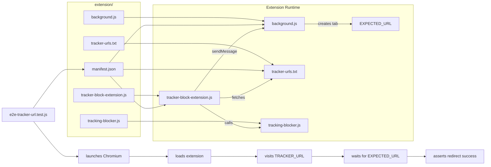

# Tracker Bypass - Chrome Extension


## Design


```mermaid
graph LR
  %% Puppeteer Test Logic
  TestScript[e2e-tracker-url.test.js] --> Launch[launches Chromium]
  Launch --> LoadExt[loads extension]
  LoadExt --> TestPage[visits TRACKER_URL]
  TestPage --> WaitTab[waits for EXPECTED_URL]
  WaitTab --> Assert[asserts redirect success]

  %% Extension Runtime
  subgraph Extension Runtime
    ContentScript[tracker-block-extension.js]
    Background[background.js]
    ContentScript -->|fetches| URLList[tracker-urls.txt]
    ContentScript -->|calls| Bypass[tracking-blocker.js]
    ContentScript -->|sendMessage| Background
    Background -->|creates tab| EXPECTED[EXPECTED_URL]
  end

  %% Filesystem Source
  subgraph extension/
    Manifest[manifest.json]
    ContentScriptFS[tracker-block-extension.js]
    BackgroundFS[background.js]
    BypassFS[tracking-blocker.js]
    URLListFS[tracker-urls.txt]
  end

  Manifest --> ContentScript
  Manifest --> Background
  Manifest --> URLList
  ContentScriptFS --> ContentScript
  BackgroundFS --> Background
  BypassFS --> Bypass
  URLListFS --> URLList

  %% External connections
  TestScript --> Manifest

```

## Testing

```bash
node tests/e2e-tracker-url.test.js
```

