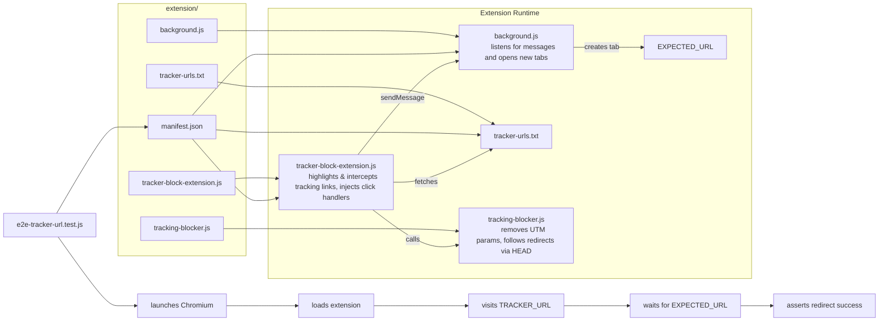

# Tracker Bypass - Chrome Extension

## Design



## Testing

```bash
node tests/e2e-tracker-url.test.js
```

## 🛠️ Writing a Dagger Pipeline for Your Project

This section outlines best practices and step-by-step guidance to author a Dagger pipeline that:

1. **Tests** your application (in our case, a Chrome extension via Puppeteer)
2. **Packages** the artifacts (ZIP for Chrome Web Store) only if tests pass

---

### 1. Project Layout

```
.
├── extension/            # Chrome extension source
├── tests/                # Puppeteer E2E tests
│   └── e2e-tracker-url.test.js
├── .dagger/              # Dagger module code & generated SDK
│   ├── main.go           # Pipeline definitions
│   └── internal/dagger   # SDK bindings
└── README.md             # Documentation
```

---

### 2. Define the Pipeline in Go

1. **Initialize Dagger SDK**

   ```go
   client, err := dagger.Connect(ctx)
   defer client.Close()
   ```

2. **Mount Host Directory**

   ```go
   src := client.Host().Directory(".", dagger.HostDirectoryOpts{})
   ```

3. **Run Tests**

   - Use a container image with Node.js & Chromium (e.g., Playwright):

     ```go
     container := client.Container().From("mcr.microsoft.com/playwright:v1.44.0-jammy").
       WithMountedDirectory("/app", src).
       WithExec([]string{"npm", "ci"}).
       WithExec([]string{"node", "tests/e2e-tracker-url.test.js"})
     ```

   - Capture logs:

     ```go
     logs, err := container.Stdout(ctx)
     ```

4. **Package Artifacts**

   - Use a minimal image (e.g., Alpine) to zip your extension:

     ```go
     container := client.Container().From("alpine:3.16").
       WithMountedDirectory("/app", src).
       WithExec([]string{"apk", "add", "--no-cache", "zip"}).
       WithExec([]string{"zip", "-r", "/app/tracker-bypass.zip", "."})
     zipFile := container.File("/app/tracker-bypass.zip")
     ```

5. **Combine Steps**

   - In `BuildPipeline`, call `TestExtension`, check for errors, then `PackageExtension`:

     ```go
     logs, err := m.TestExtension(ctx)
     if err != nil {
       return nil, err
     }
     return m.PackageExtension(ctx)
     ```

---

### 3. Debugging Tips

- **Echo debug steps** inside containers using `WithExec([]string{"echo", "[Debug] Message"})`.
- **Enable Dagger logs** with:

  ```go
  client, _ := dagger.Connect(ctx, dagger.WithLogOutput(os.Stdout))
  ```

- **Export artifacts** back to your host using the Dagger CLI:

  ```bash
  dagger call BuildPipeline --source . --output tracker-bypass.zip
  ```

---

### 4. Common Pitfalls

- **Module names**: Ensure your Go module path (`.dagger/go.mod`) matches struct names used by codegen.
- **CDP vs. BiDi**: Use default CDP for reliable Chrome extension loading in Puppeteer.

---

## Dagger Function Parameters Overview

**Input Types:**
Dagger functions can accept a variety of parameter types. Common inputs include:

- **`*dagger.Directory`:** For passing directories from the host into the pipeline (e.g., source code, config files).
- **`*dagger.File`:** For passing individual files from the host.
- **Primitive types:**
  - `string` (e.g., for configuration values)
  - `int` (e.g., for numeric settings)
  - `float64` (e.g., for floating-point numbers)
  - `bool` (e.g., for feature flags)
- **Lists/Slices:**
  - `[]string` (e.g., for multiple file paths or options)
- **Optional parameters:**
  - Marked with `// +optional` (Go) or default values in other languages.

**Default Values:**
You can set default values for parameters. In Go, use a pragma comment above the argument:

```go
func (m *MyModule) Example(
    // +default="some-value"
    param string,
    // +defaultPath="."
    dir *dagger.Directory,
) { /* ... */ }
```

This ensures that if a value isn’t provided, Dagger uses the specified default[^1].

**When to Use `context.Context`:**

- **Use `context.Context`** as a parameter when your function needs to support cancellation, timeouts, or request-scoped values.
- **Do not use `context.Context`** for passing data or files. Dagger injects the context automatically at runtime[^1].

**Examples from Sample Projects:**

- **Passing directories:**
  - `func (m *MyModule) Build(ctx context.Context, src *dagger.Directory) (*dagger.File, error)`
- **Passing strings:**
  - `func (m *MyModule) Greet(name string) string`
- **Optional parameters:**
  - `func (m *MyModule) Hello(ctx context.Context, // +optional name string) string`

**Summary Table:**

| Parameter Type        | Use Case                     | Default Example              |
| :-------------------- | :--------------------------- | :--------------------------- |
| `*dagger.Directory`   | Host directory input         | `// +defaultPath="."`        |
| `*dagger.File`        | Host file input              | `// +defaultPath="file.txt"` |
| `string`, `int`, etc. | Configuration, flags         | `// +default="value"`        |
| `[]string`            | Multiple options/files       | (No default; optional)       |
| `context.Context`     | Cancellation/timeout support | (Injected by Dagger)         |

---

**In summary:**
Use `*dagger.Directory` or `*dagger.File` for filesystem inputs, primitive types for configuration, and `context.Context` for lifecycle management. Set defaults with pragma comments for convenience and flexibility[^1][^2][^4].

[^1]: <https://docs.dagger.io/api/arguments>
[^2]: <https://docs.dagger.io/api/documentation>
[^4]: <https://github.com/playgroundtech/dagger-go-example-app>

## 🔋 Powered by devenv

This project uses devenv (<https://devenv.sh>) to define a reproducible, declarative developer environment.

Key features:

- Instant setup — auto-installs Node.js 20, Go, Puppeteer, and Chrome
- Built-in testing — run Chrome Extension tests via Dagger: `test-extension`
- One-time setup — run `init-dagger` to scaffold a Dagger testing pipeline in Go
- Pre-commit hooks — run automated tests on staged JS/JSON/txt changes
- Helpful shell welcome — shows project status and guidance on entry

Devenv Highlights:

packages = with pkgs; [ nodejs_20 go ];
env = {
CHROME_BIN = "${pkgs.google-chrome}/bin/google-chrome-stable";
PUPPETEER_SKIP_CHROMIUM_DOWNLOAD = "true";
};
scripts.init-dagger.exec = "dagger init --sdk=go";
scripts.test-extension.exec = "dagger call test-extension --src=.";

Just clone the repo and run `devenv shell` — no Dockerfiles, Makefiles, or setup docs needed.
